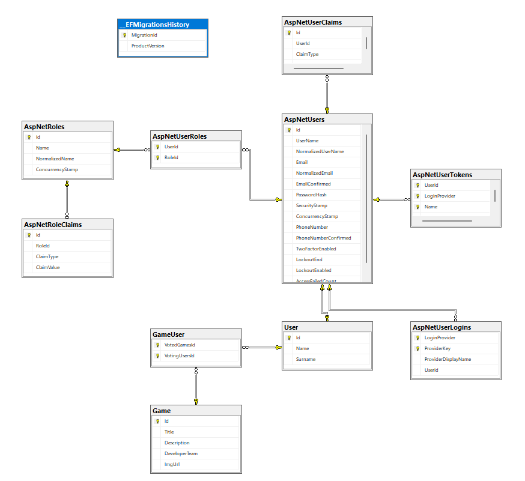

# T1.PR2. APIrest

# Descripció del Projecte

Aquest projecte es una aplicació web completa desenvolupat en .NET, que inclou una API REST i un client razor pages que utilitza aquesta API. El projecte està dissenyat per gestionar un catàleg de videojocs, permetre als usuaris registrar-se, iniciar sessió, votar els jocs.

# Esquema Base de dades

# Bibliografia

Gupta, L. (8 d’abril de 2025). REST API Introduction. GeeksforGeeks. Recuperat el 22 abril 2025 de [Link](https://www.geeksforgeeks.org/rest-api-introduction/​)

Gupta, L. (2 de juny de 2018). REST HATEOAS. RESTfulAPI.net. Recuperat el 22 abril 2025 de [Link](https://restfulapi.net/hateoas/​)

Red Hat. (s.d.). What is a REST API?. Red Hat. Recuperat el 22 abril 2025 de [Link](https://www.redhat.com/en/topics/api/what-is-a-rest-api)

Buelthoff, F., i Maleshkova, M. (20 de febrer de 2019). RESTful or RESTless – Current State of Today's Top Web APIs. arXiv. Recuperat el 22 abril 2025 de [Link](https://arxiv.org/abs/1902.10514​)

Malakhov, K., Kurgaev, O., i Velychko, V. (12 de novembre de 2018). Modern RESTful API DLs and frameworks for RESTful web services API schema modeling, documenting, visualizing. arXiv. Recuperat el 22 abril 2025 de [Link](https://arxiv.org/abs/1811.04659​)
